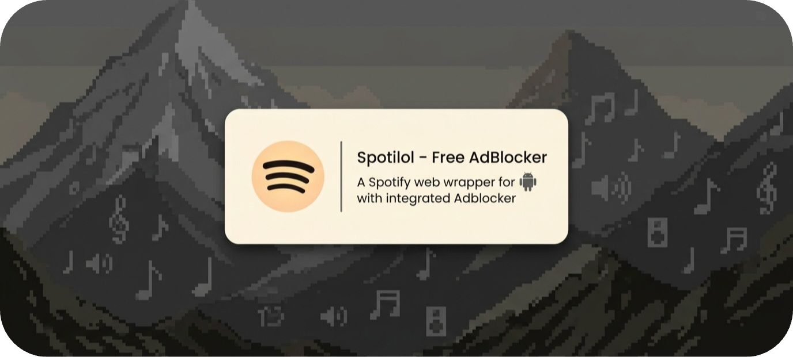
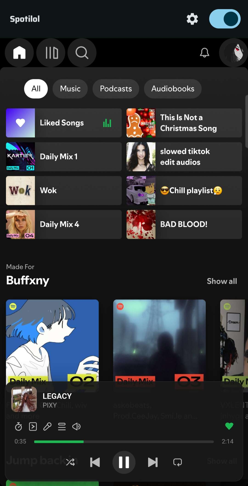
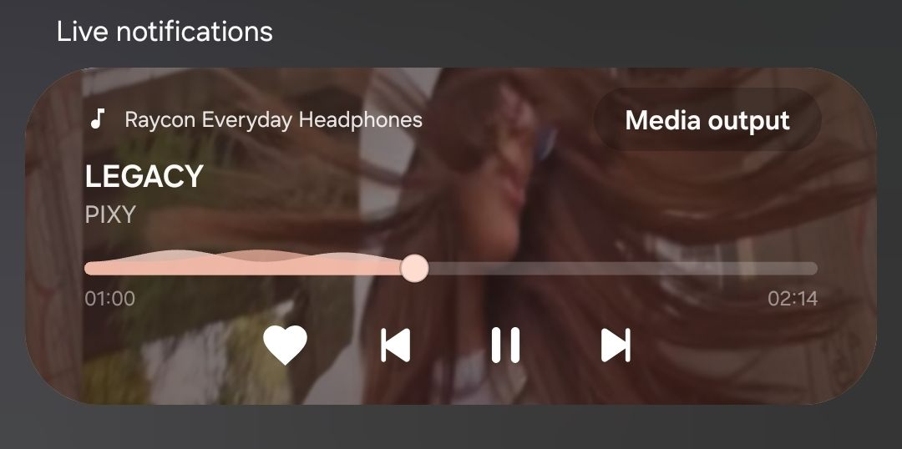
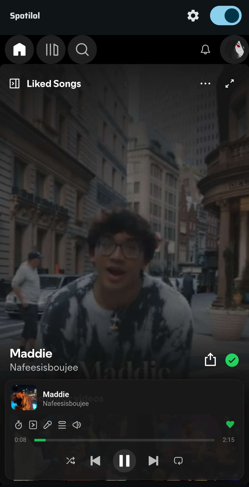

<div align="center">
  
</div>

<h1 align="center">SpotiBat</h1>

<p align="center">
  <a href="https://github.com/Pro-mwas1234/SpotiBat/stargazers">
    
  </a>
  &nbsp;
  <a href="https://github.com/Pro-mwas1234/SpotiBat/releases">
    
  </a>
  &nbsp;
  <a href="https://github.com/Pro-mwas1234/SpotiBat/releases/latest">
    
  </a>
  &nbsp;
  <a href="https://github.com/Pro-mwas1234/SpotiBat/forks">
    
  </a>
  &nbsp;
  <a href="https://github.com/Pro-mwas1234/SpotiBat/commits/main">
    
  </a>
  &nbsp;
  <a href="https://deepwiki.com/Pro-mwas1234/SpotiBat">
    
  </a>
</p>

<p align="center">
  an Android app that wraps Spotify's web player with built-in adblocking — no root, no shady mods, just your Spotify account on a slick WebView.
</p>

<p align="center">
  ported from smali to clean Kotlin by <strong>Pro-mwas1234</strong>, based on deviato's <strong>Spotifuck</strong>. free, open-source, and it just works.
</p>

---


## Download

<div align="center">
  <a href="https://github.com/Pro-mwas1234/SpotiBat/releases/latest">
    
  </a>
</div>

download the `.apk` and install it on your device. you may need to toggle **"Install from unknown sources"** in your Settings.

---

## Preview

<div align="center">
  
  
  
</div>

---

## Features

- blocks audio ads & telemetry
- media notification: play/pause, skip, seek, like/unlike, shuffle, repeat with custom actions
- **Android Auto**: browse your playlists, albums, artists, and podcasts; search and play from the car dashboard
- **offline downloads**: download songs and play them offline — audio is sourced via the InnerTube API
- lock screen, Bluetooth, and Wear OS controls
- autoplay modes: off, once at start, or permanent
- mobile-friendly CSS/JS layout tweaks
- AMOLED dark mode (pure black)
- sleep timer
- update checker (auto & manual)
- multiple account profiles
- browse your library through Spotify's pathfinder API
- picture-in-picture (PiP) support
- wake lock controls & power save mode

---

## Requirements

- Android 8.0+ (API 26)
- a Spotify account (free or premium)
- Google Chrome / WebView (comes with your phone)

---

## Quick Start

install the APK, open it, done. SpotiBat runs in **normal mode** by default — no certificate, no setup, no "Certificate Required" screen. it just works out of the box.

---

## Proxy MITM Mode (optional)

want the full fingerprint treatment? flip the mode in **Settings → Connection Mode → "MITM Proxy (Certificate)"**. the app restarts and walks you through the cert install.

### The Certificate Thing

SpotiBat generates a local CA cert so Spotify doesn't know you're in a WebView. it lives on your device, stays on your device.

1. open SpotiBat in proxy mode — you'll see the **"Certificate Required"** screen
2. tap **"Export .pem"** to save it to your Downloads
3. go to **Settings > Security > Encryption & Credentials > Install a certificate > CA certificate**
4. find `spotiBat_ca.pem` in your Downloads and tap it
5. it'll warn you about network monitoring — tap **"Install anyway"**
6. come back to SpotiBat and tap **"Check"**. if it worked, you're in.

> **Note:** if you ever clear your device's credential storage (like after a factory reset), you'll have to do this again.

---

## Build It Yourself

```bash
git clone https://github.com/Pro-mwas1234/SpotiBat
cd SpotiBat
./gradlew assembleDebug
```

APK lands at `app/build/outputs/apk/debug/app-debug.apk`.

### Google Services

this project uses Firebase (analytics, crash reporting, performance). to build, you need:

1. create a Firebase project at [console.firebase.google.com](https://console.firebase.google.com)
2. register an Android app with package name `com.mwask.bat`
3. download the `google-services.json` and place it in `app/`

---

## Contributing

contributions are welcome. open issues, throw PRs, suggest stuff — free for all.

---

## Credits
**pro-mwas1234**  did someshii
**deviato** reverse-engineered the original Spotifuck. **Pro-mwas1234** ported the core logic from smali to Kotlin and maintains this project.

all rights reserved — Pro-mwas1234 & deviato.